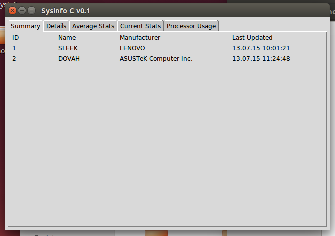

# Overview
*sysinfo* is an application designed to real-time system information to another computer over the network and display it on another system. It composed of two Python 2.7 applications with GUI. The project was made for a practical interview and employs many programming techniques: multi-threading, networking, interface design, unit testing.

The first Python application, named **sysinfo**, accesses the WMI interface from Microsoft Windows operating systems to display information (Computer Manufacturer, OS Version, etc.) and statistics (CPU, memory, etc.). It is also designed to send the collected information to an AMQP server over the network.

The second application, named **sysinfoc** (c from collector), was made to connect to the local AMQP server and display the information gathered, saving all this information to an SQLite database.

# Requirements
Python v2.7: [Download](https://www.python.org/downloads/).

To use *sysinfo* on a Windows computer, the following requirements need to be fulfilled:
- WMI Python library: [Download](https://pypi.python.org/pypi/WMI/) or 'pip install wmi' in the command prompt
- Python for Windows Extensions: [Download](http://sourceforge.net/projects/pywin32/files/pywin32/Build%20219/pywin32-219.win32-py2.7.exe/download)
- Pika AMQP Library: [Download](https://pypi.python.org/pypi/pika) or 'pip install pika'

To use *sysinfoc* on a Windows computer:
- SQLAlchemy: [Download](https://pypi.python.org/pypi/SQLAlchemy/1.0.6) or 'pip install sqlalchemy'
- Pika AMQP Library: [Download](https://pypi.python.org/pypi/pika) or 'pip install pika'
- Erlang (for RabbitMQ): [Download](http://www.erlang.org/download.html)
- RabbitMQ: [Download](https://www.rabbitmq.com/download.html)

**Note for Linux users:** The following steps have been made when installing Python on an Ubuntu machine.
In a terminal, run:
> sudo apt-get install tk-dev
>
> sudo apt-get install python-pip
>
> sudo apt-get install openssl
>
> sudo apt-get build-dep python2.7

In the terminal positioned in the directory where the Python installation files have been extracted, run:

> ./configure --prefix=/opt --with-ssl --enable-unicode=ucs2
>
> make
>
> sudo make install

Then, for installing requirements, run:
> sudo pip install pika -t /opt/lib/python2.7
>
> sudo pip install sqlalchemy -t /opt/lib/python2.7
>
> sudo apt-get install rabbitmq-server

Then run in the *sysinfoc* repository folder:

> /opt/bin/python sysinfoc.pyw

# Setup
Simply download this repository on your computer and run *sysinfo.pyw* for clients and *sysinfoc.pyw* for server (where RabbitMQ is installed).

Before doing that, though, it is necessary to run the following commands in the command prompt of the server (where RabbitMQ is running and sysinfoc.pyw shall be run):
> cd C:\Program Files (x86)\RabbitMQ Server\rabbitmq_server-3.5.3\sbin
>
> rabbitmqctl add_user "sysinfo" "sysinfo"
>
> rabbitmqctl set_permissions -p / "sysinfo" ".\*" ".\*" ".\*"

Without these commands, the client won't be able to connect to the RabbitMQ server remotely.

# Usage
To run *sysinfo* in a state of reporting to a remote server, open a command prompt in the same directory as the repository (where *sysinfo.pyw* is), and enter:

> python sysinfo.pyw [server_ip]

For example, if my server is running on the computer I also what the client to run on, I enter:

> python sysinfo localhost

If the server runs on my LAN network, on 192.168.1.13, I enter:

> python sysinfo 192.168.1.13

The application will start, pool WMI (as notified in the title) and not show anything for a few seconds, then show the information and report in the background to the RabbitMQ Server at the IP entered in the command prompt (and noted in the title bar after load).

Otherwise, you can simply open *sysinfo* in a state of not reporting to a remote server, by double-clicking on the *sysinfo.pyw* file or running in the command prompt:

> python sysinfo.pyw

To run *sysinfoc*, just double click the *sysinfoc.pyw* file or simply enter in the command prompt (in the same directory as the repository):

> python sysinfoc.pyw

The application will run and start showing a list of computers that have their information currently collected and the last time this information was updated. It'll also start constructing a SQLite database file, named *sysinfo.db*, in the background, with the information collected. Next time it starts, even if no computer is connected to the RabbitMQ server, the application will show relevant information pulled from the database.

# Tested
The applications have been tested on:
- two Windows laptops connected to a local network
- a Windows laptop and a Ubuntu virtual machine installed on said laptop

# Room for improvement

Other possible improvements are:
- UI: Change Tkinter to another GUI library since *sysinfoc* needs better handling of constant updating of labels
- General: Packaging of the application for installation
- General: Horizontal auto scrollbar
- General: Handle closing of the applications (close connections, stop threads, delete queues)
- *sysinfo*: The GUI to be asking for an IP and not for the IP to be manually entered from the command prompt
- *sysinfo*: Clients to not broadcast if no-one is listening
- *sysinfoc*: General refactorization of the database part of the application, as there is possibility for fewer queries that can be made for each thread loop
- *sysinfoc*: A "now" or "x minutes/hours/days ago" in the Last Updated column
- *test*: More and better tests
